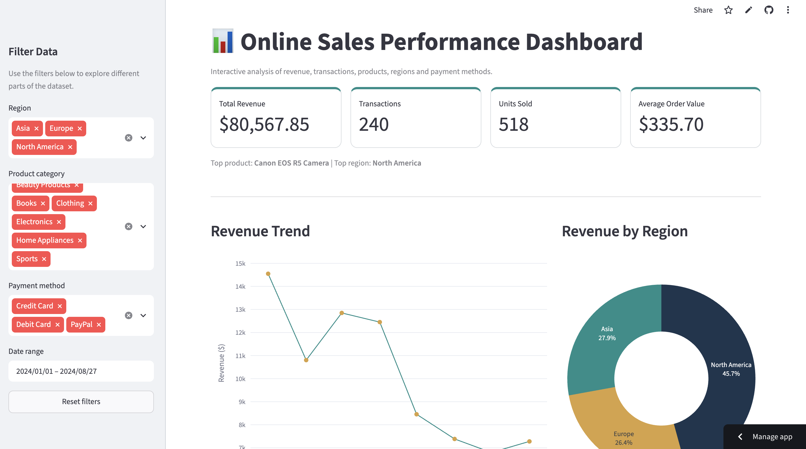

# Online Sales Interactive Dashboard

An interactive sales analytics dashboard built with **Python, Streamlit, Pandas, and Plotly** to explore online sales performance across products, regions, payment methods, and time.

## Dashboard Preview



## Project Overview

This project transforms online sales transaction data into an interactive dashboard that enables users to explore key sales metrics, identify top-performing products and regions, analyze revenue trends, and filter results dynamically.

The dashboard is designed to make sales data easier to interpret through interactive visualizations and key performance indicators (KPIs).

## Dashboard Features

The dashboard includes:

* Interactive filtering by **date, region, product category, and payment method**
* Total Revenue
* Total Transactions
* Units Sold
* Average Order Value
* Top-Performing Product
* Top-Performing Region
* Monthly Revenue Trend
* Revenue by Product Category
* Regional Revenue Performance
* Top 10 Products by Revenue
* Revenue by Payment Method
* Interactive Plotly charts with hover information
* Filtered transaction-level data
* CSV download functionality

## Dataset

The dataset contains **240 online sales transactions** with information including:

* Transaction ID
* Date
* Product Category
* Product Name
* Units Sold
* Unit Price
* Total Revenue
* Region
* Payment Method

The dashboard uses these variables to provide an interactive view of sales performance and customer purchasing patterns.

## Technologies Used

* **Python** – application programming language
* **Streamlit** – interactive dashboard framework
* **Pandas** – data cleaning, manipulation, aggregation, and analysis
* **Plotly** – interactive data visualizations
* **GitHub** – source code and version control
* **Streamlit Community Cloud** – application deployment and hosting

## How to Run the Dashboard Locally

Clone this repository:

```bash
git clone https://github.com/cbosiemo/online-sales-dashboard.git
```

Navigate into the project directory:

```bash
cd online-sales-dashboard
```

Install the required Python packages:

```bash
pip install -r requirements.txt
```

Run the Streamlit application:

```bash
streamlit run dashboard.py
```

## Live Dashboard

The interactive dashboard is deployed using Streamlit Community Cloud.

**Live application:** https://online-sales-dashboard-dyp7bucpadwuthdwugwa28.streamlit.app/

## Repository Structure

```text
online-sales-dashboard/
├── .gitignore
├── dashboard.py
├── Online_Sales_Data.csv
├── dashboard-preview.png
├── requirements.txt
└── README.md
```

## Key Learning Outcomes

Through this project, I strengthened my practical understanding of:

* Building interactive data applications with Streamlit
* Data manipulation and aggregation using Pandas
* Creating interactive visualizations with Plotly
* Designing KPIs for business performance analysis
* Implementing dynamic filters for exploratory analysis
* Using GitHub for source control and project management
* Deploying a Python application to the web using Streamlit Community Cloud

## Future Improvements

Potential extensions to the dashboard include:

* Sales forecasting
* Year-over-year and month-over-month growth analysis
* Customer segmentation
* Profit and margin analysis where cost data is available
* Geographic sales visualizations
* Automated data updates from a database or API

## Author

**Cynthia Osiemo**

Data Science | Data Analytics | Research
